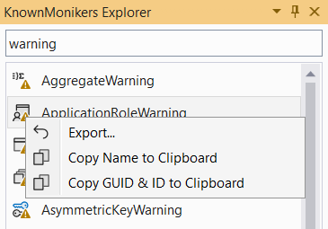
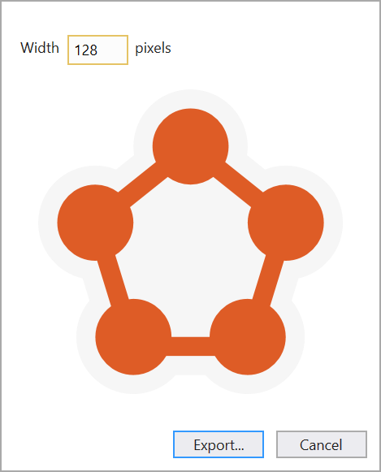

[marketplace]: <https://marketplace.visualstudio.com/items?itemName=MadsKristensen.KnownMonikersExplorer2022>
[vsixgallery]: <http://vsixgallery.com/extension/c38f3512-4653-4d97-a4c5-860a425209f5/>
[repo]: <https://github.com/madskristensen/KnownMonikersExplorer>

# KnownMonikers Explorer

Download this extension from the [Visual Studio Marketplace][marketplace] or get the [CI build][vsixgallery]

--------------------------------------

**A tool window for Visual Studio extension authors** that lets you easily browse all the image monikers in the KnownMonikers catalog.

## Features

### Browse and Search

Open the tool window from **View → Other Windows → KnownMonikers Explorer** and filter image monikers by typing in the search box.

### Context Menu Actions

Right-click any moniker for a list of actions:

| Action | Shortcut | Description                                        |
| ------ | -------- | -------------------------------------------------- |
| Export | `Enter`  | Export moniker to PNG, JPEG, or GIF at custom size |
| Copy   | `Ctrl+C` | Copy moniker name to clipboard                     |

### Export Dialog

Export the image moniker to file in the size you specify. PNG, JPEG and GIF formats are supported.

### Find Moniker in Visual Studio

Hover the mouse over an image moniker in Visual Studio (for example, an image on a toolbar button) and press `Ctrl+Shift+Alt+Q`. The KnownMonikers Explorer window will open and highlight the image moniker.

## Requirements

- Visual Studio 2022 (17.0 or later)

## Related Resources

- [Image Service and Catalog](https://msdn.microsoft.com/en-US/library/mt628927.aspx)
- [Image Library Viewer](https://msdn.microsoft.com/en-us/library/mt629250.aspx)
- [Glyph List](http://glyphlist.azurewebsites.net/)

## License

- This extension: [Apache 2.0](LICENSE)
- [License for the images](https://www.microsoft.com/download/details.aspx?id=35825)

## How can I help?

Give it a rating on the [Visual Studio Marketplace][marketplace] or report issues on [GitHub][repo].
